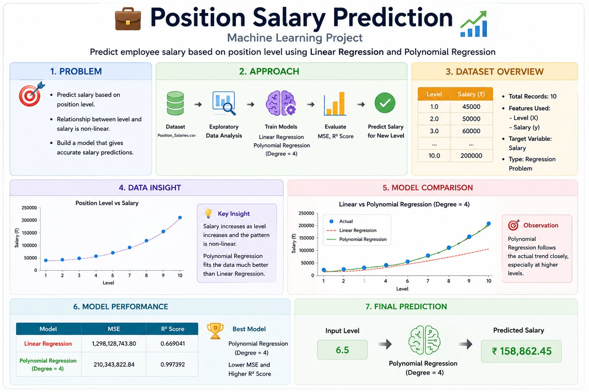

# Position-Salary-Prediction

<p align="center">
  
</p>

## Project Overview

A Machine Learning project that predicts **salary based on position level**.

- **Type:** Supervised Learning
- **Problem:** Regression
- **Input (X):** Level
- **Target (y):** Salary
- **Models:** Linear Regression & Polynomial Regression
- **Polynomial Degree:** 4

---

## 📂 Dataset

**Dataset:** `Position_Salaries.csv`

| Feature | Description |
|---|---|
| Position | Employee Designation |
| Level | Newmerical Position Level |
| Salary | Target Salary |


```text
X = Level
y = Salary 
```
---

## 🔎 EDA

The dataset was analyzed using:
- Dataset inspection
- info()
- describe()
- Missing value check
- Scatter plot

Observation
- Salary increases with position level.
- Salary growth is not constant.
- The relationship is non-linear.

## 📈 Linear Regression

Linear Regression was used as a baseline model.

```y = mx + c ```
It represents the relationship using a straight line.
